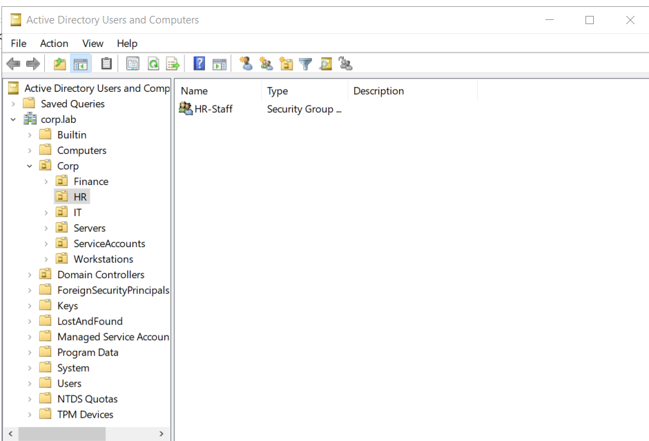
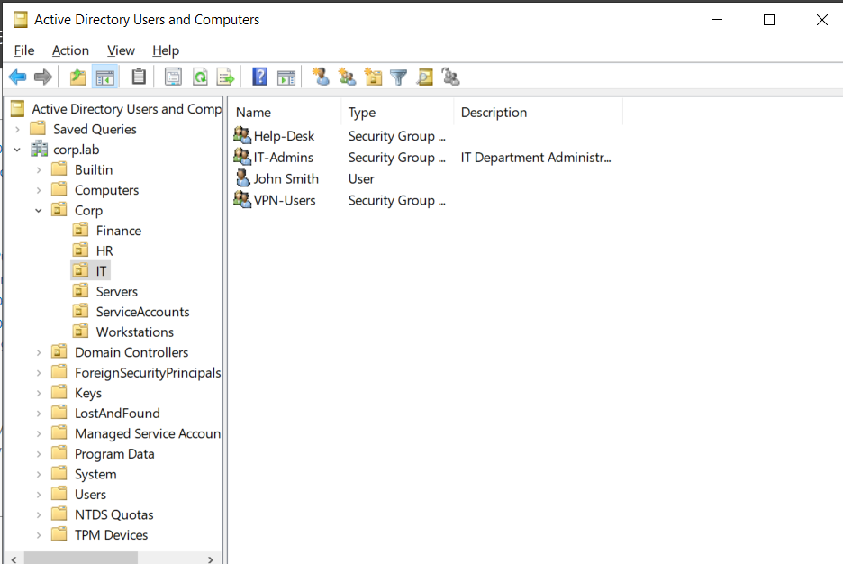
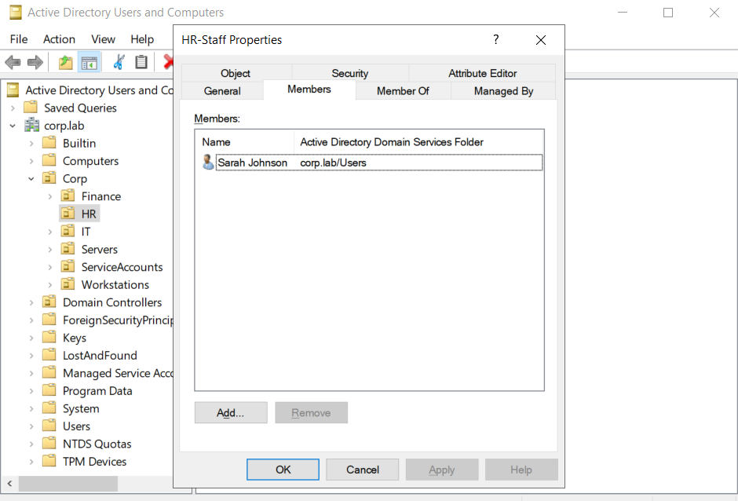

# 🏠 Active-Directory-Homelab
## Overview
---
This project demonstrates the deployment and administration of a Windows Active Directory environment in a virtualized lab.
The goal was to simulate common enterprise identity and access management tasks performed by System Administration and SOC analysis.

---
## Skills Demonstrated 
• Active Directory Administration → Windows Server 2022 → DNS Configuration 
• User & Group Management
• Group Policy Management
• Domain Join Operations
• Organizational Unit Design
• Identity & Access Management Fundamentals
• Windows Troubleshooting
## ⚙️Technologies Used
• VMware Workstation Player/Pro
• Windows Server 2022 ISO
• Windows 10 Enterprise ISO
• Active Directory Domain Services (AD DS)
  
## 🔬Lab Architecture
Physical Host (desktop/laptop)
- Hypervisor (VMware Workstation Player/Pro, Hyper-V, or VirtualBox. Your choice.)
  - VM 1 - DC01 (Domain Controller)
      - Windows Server 2022
      - Active Directory Domain Services
      - DNS Server (192.168.10.10)
      - DHCP Server (scope: .100 - .200)
      - Static IP: 192.168.10.10
   - VM 2 - SRV01 (Member Server)
        - Windows Server 2022
        - File shares (HR-Confidential)
        - Optional: RODC role
        - Static IP: 192.168.10.20
    - VM 3 - WIN10-CLIENT
      
      - Windows 10 Enterprise
      - Domain joined to corp. lab

      - Dynamic IP via DHCP (.100 - .200 range)
## Virtual Machines
## Network Topology
## Documentation
## 📸 Screenshots

### 1. **Active Directory Domain Services Install**

  ---
  
 
  

### 2. **Active Directory Users and Computers (Users, Groups, OUD)**
> Created the Organizational Unit.
   ---

> Created the IT users and admins.

> Created the HR staff.

### 3. **DNS Manager**
 
  ---

  
  ---

### 4. **Domain Controller**

### 5. **Domain Join & Domain User Login**
  
### 6. **Group Policy Management**

   ---

### 7. **Network & DNS Verification
   

   
