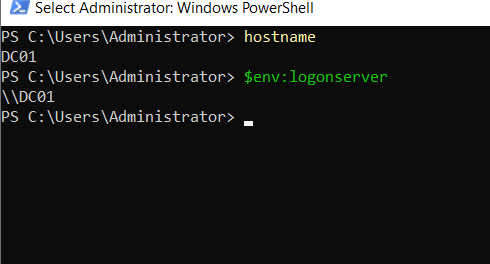
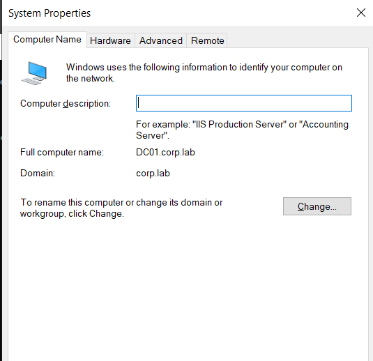
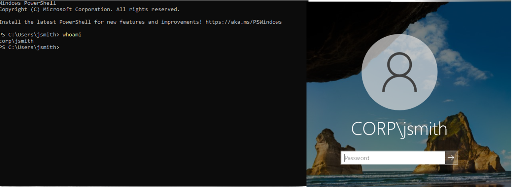
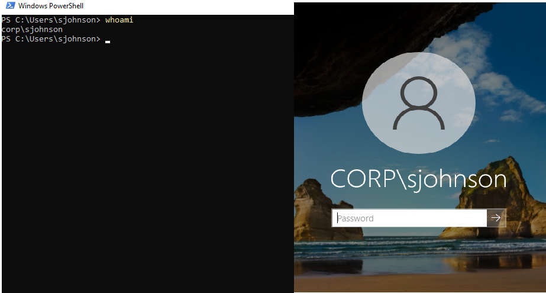
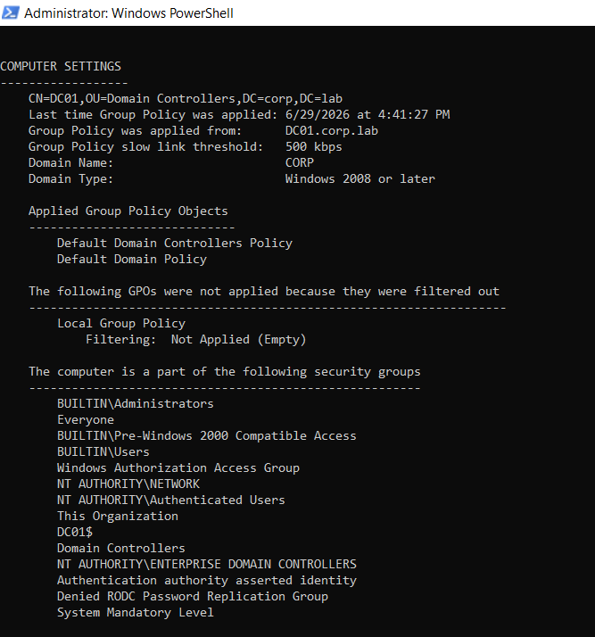
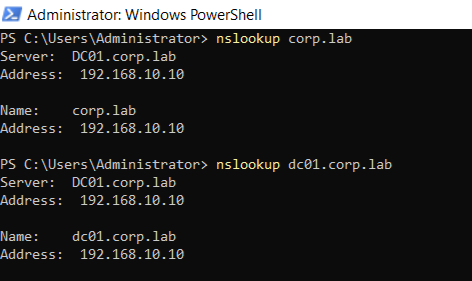
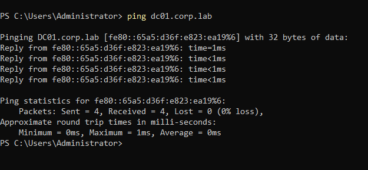

# Enterprise Active Directory Deployment Lab

## Project Status
✅ Completed

This lab establishes the foundational active Directory environment that will be expanded in future labs including Group Policy Objects, Organizational Units (OUs), firewall configuration (preferably FortiGate), Network troubleshooting, Window Event Logging, Splunk integration, Sysmon deployment, and Active Directory security monitoring.

---
## Overview

In this lab you will see a simulated coporate network by deploying a windows Server 2022 Domain Controller, configuring Active Directory Domain Service (AD DS) and DNS, and joining a Windows 10 workstation to the domain.

This project demonstrates the deployment and implementation of a Windows servers administration, Active Directory fundamentals environment, Identity and Access Management, and enterprise networking in a virtualized lab.

The goal was to simulate common enterprise identity and access management tasks performed by Systems Administration, Help Desk, and Security Operations Center (SOC) environments. 

---

## Objectives

• Build a Windows Server 2022 Active Directory environment.

• Configure Active Directory Domain Services (AD DS).

• Configure Active Directory DNS.

• Deploy a Windows 11 Pro (client) workstation.

• Join a Windows 11 client to the active directory domain.

• Create a new active Directory forest 
(corp.local)

• Create and manage Organizational Units (OUs), users, security groups, and computer objects.

• Configure Group Policy Objects (GPOs) for centralized administration.

• Validate Kerberos authentication and domain login functionality.

• Test the environment by simulating failed logins and verifying account lockout behavior.

• Document the deployment, configuration, and testing process.

---  

## Lab Environment
Physical Host (desktop/laptop)
- Hypervisor (VMware Workstation Player/Pro)
  - VM 1 - DC01 (Domain Controller)
      - Windows Server 2022
      - Active Directory Domain Services
      - DNS Server (192.168.10.10)
      - DHCP Server (scope: .100 - .200)
      - Static IP: 192.168.10.10
   - VM 2 - SRV01 (Member Server)
        - Windows Server 2022
        - File shares (HR-Confidential)
        - Optional: RODC role
        - Static IP: 192.168.10.20
    - VM 3 - WIN11-CLIENT
      
      - Windows 11 Enterprise
      - Domain joined to corp. lab

      - Dynamic IP via DHCP (.100 - .200 range)
     
---
## Network Architecture
          

                     AD_LAB Network (192.168.10.0/24)

                               Internet
                                   │
                         Router / Gateway
                                   │
                           VMware Workstation
                                   │
                     Virtual Network (VMnet)
                                   │
             ┌─────────────────────┴─────────────────────┐
             │                                           │
    ┌─────────────────────┐                   ┌─────────────────────┐
    │ Domain Controller   │                   │ Client Workstation  │
    │---------------------│                   │---------------------│
    │ Hostname: DC01      │                   │ Hostname: WIN11     │
    │ Windows Server 2022 │                   │ Windows 11 Pro      │
    │ AD DS               │◄────────────────►│ Domain Joined        │
    │ DNS                 │   Kerberos       │ Group Policy Client  │
    │                     │   LDAP           │                      │
    │ 192.168.10.10      │   DNS            │ 192.168.10.20       │
    └─────────────────────┘                   └─────────────────────┘

---

## Technologies Used
• VMware Workstation Player/Pro
• Windows Server 2022 ISO
• Windows 11 Enterprise ISO
• Active Directory Domain Services (AD DS)

---

## Implementation

### Phase 1 – Environment Planning

**Purpose**

Design the virtual environment and define the network architecture before deployment.

**Tasks Completed**
- Selected VMware Workstation as the virtualization platform.
- Planned the Active Directory network topology.
- Assigned static IP addresses for lab systems.
- Configured the virtual network.
- Defined the domain structure (corp.local).
- Planned server and workstation roles.

---

### Phase 2 – Windows Server Deployment

**Purpose**

Install and configure the Windows Server that will become the Domain Controller.

**Tasks Completed**
- Installed Windows Server 2022.
- Configured hostname (DC01).
- Assigned a static IP address.
- Verified network connectivity.
- Applied system updates.
- Performed initial server configuration.

---

### Phase 3 – Active Directory Configuration

**Purpose**

Deploy Active Directory Domain Services and create the domain environment.

**Tasks Completed**
- Installed Active Directory Domain Services (AD DS).
- Promoted the server to a Domain Controller.
- Created the corp.local domain.
- Configured DNS.
- Verified Active Directory replication and services.

---
### Phase 4 – Directory Administration

**Purpose**

Configure the organizational structure used to manage users and computers.

**Tasks Completed**
- Created Organizational Units (OUs).
- Created user accounts.
- Created security groups.
- Managed computer objects.
- Configured administrative accounts.

---

### Phase 5 – Windows 11 Client Deployment

**Purpose**

Deploy a Windows 11 workstation and integrate it into the domain.

**Tasks Completed**
- Installed Windows 11.
- Configured network settings.
- Joined the workstation to the domain.
- Verified domain authentication.
- Tested user logins.

---

### Phase 6 – Group Policy Implementation

**Purpose**

Centralize management of security and workstation configurations.

**Tasks Completed**
- Configured Group Policy Objects (GPOs).
- Applied password complexity requirements.
- Configured account lockout policies.
- Verified policy application using gpupdate and gpresult.
- Confirmed Group Policy inheritance.

---
### Phase 7 – Security Validation

**Purpose**

Verify that Active Directory security controls function correctly.

 **Tasks Completed**
- Tested domain authentication.
- Simulated failed login attempts.
- Triggered account lockout.
- Reviewed Windows Security Event Logs.
- Verified DNS resolution.
- Confirmed Kerberos authentication.

---
### Phase 8 – Documentation

**Purpose**

Produce technical documentation suitable for a professional portfolio.

**Tasks Completed**

- Documented deployment procedures.
- Created network diagrams.
- Recorded screenshots.
- Documented testing methodology.
- Organized project repository.
- Published project to GitHub.

---

## Skills Demonstrated 

|||
| :--- | :--- |
| • Active Directory Administration | • Domain Join Operations | 
| • User & Group Management         | • Group Policy Management | • Windows Server 2022
| • DNS Configuration               | • Organizational Unit Design
| • Identity & Access Management Fundamentals | • Windows Server 2022 |
| • Windows Troubleshooting |

---

## Screenshots

### :zap: Quick Jump
1. [Active directory domain services install](#1-active-directory-domain-services-install)
2. [Active Directory Users and Computers (Users, Groups, OUD)](#2-active-directory-users-and-computers-users-groups-oud)
3. [DNS Manager](#3-dns-manager)
4. [Domain Controller Configuration](#4-domain-controller-configuration)
5. [Domain Join and Domain User Login](#5-domain-join--domain-user-login)
6. [Group Policy Management](#6-group-policy-management)
7. [Network & DNS Verification](#7-network--dns-verification)

### 1. **Active Directory Domain Services Install**
  Captures the successful install of Active Directory (AD DS) with the server becoming the domain controller.

  
  
 

### 2. **Active Directory Users and Computers (Users, Groups, OUD)**

  Created the Organizational Unit.
  

 Created the IT users and admins.

 Created the HR staff.

### 3. **DNS Manager**
 Evidence that the Active Directory's DNS infrastructure is operating properly.
  

  
  ---

### 4. **Domain Controller Configuration**

Evidence that active Directory was deployed.

### 5. **Domain Join & Domain User Login**

 Captured the successful integration with the domain.
 

 Captures the succeessful authentication of user & staff member, John Smith(jsmith).

 Captures the succeessful authentication of user & staff member, Sarah Johnson(sjohnson).
 

### 6. **Group Policy Management**
 Captures the group policy administration(GPO policy, password policy, login).
 
 

   
 Shows that the group policy was correctly configured and applied.
 

### 7. **Network & DNS Verification
 Verified that DNS had been correctly configured and DNS resolution is functioning properly.
 

 Shows that all servers are properly connected to the domain controller(DC01) and that network communication is up and running.
 

   
